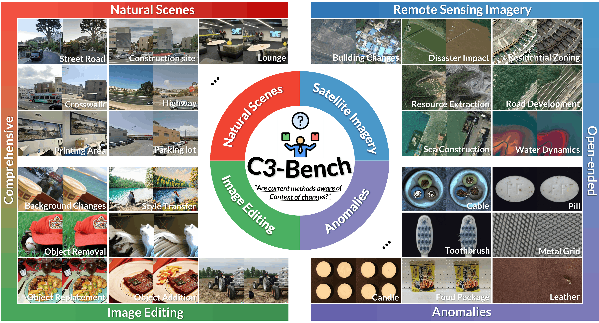
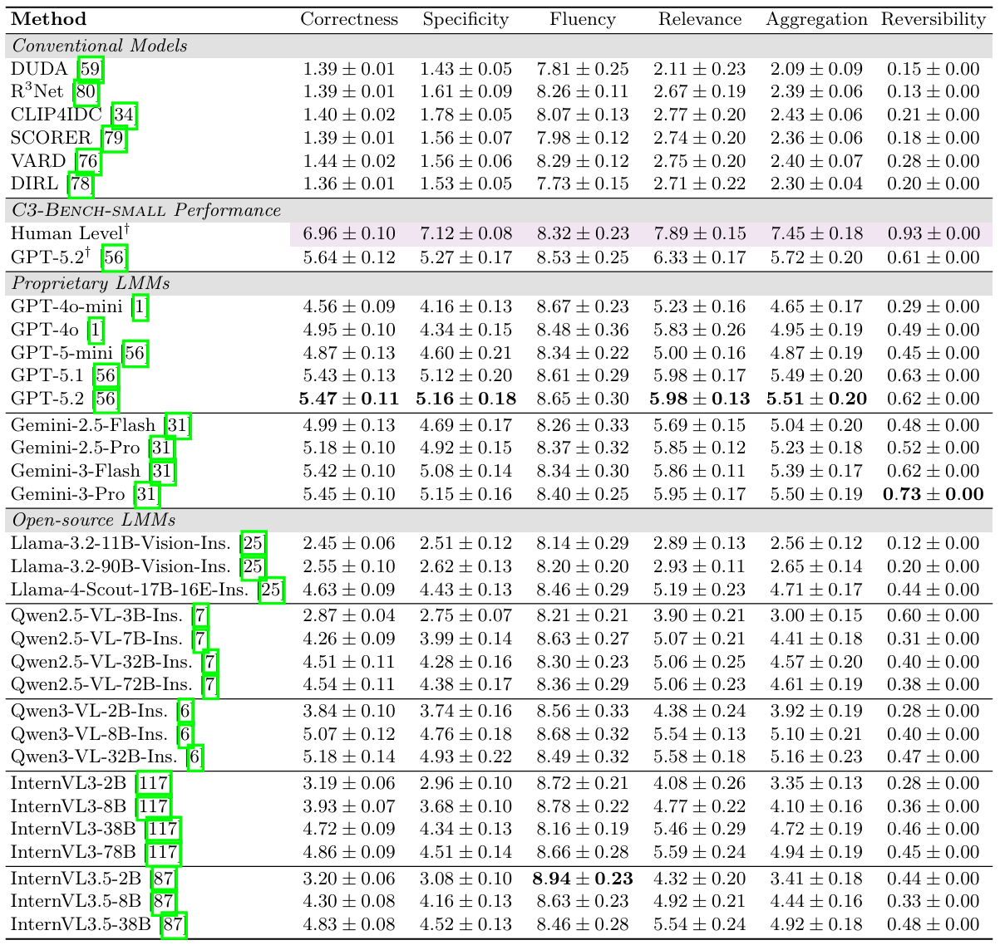

# C3-Bench: A Context-Aware Change Captioning Benchmark
This repository represents the official implementation of the paper titled "C3-Bench: A Context-Aware Change Captioning Benchmark (ECCV 2026)". 

[](#)
[](https://drive.google.com/drive/folders/1y3sVXDaJRWAJS-ZsC8DgUpQbvURFvEOx?usp=sharing)
[](LICENSE)
[](#)

<p align="center"> <a href="https://1124jaewookim.github.io/"><strong>Jaewoo Kim</strong></a> · <a href="https://hbk08101.github.io/"><strong>Hyeongbeom Kim</strong></a> · <a href="https://uehwan.github.io/people/Ue-Hwan-Kim/"><strong>Uehwan Kim</strong></a> <br> <strong>ECCV 2026</strong> </p> <div align='center'> <br> <br><strong>Overview of C3-Bench.</strong> The examples are from each context in C3-Bench. </div> <br><br>

<table>
<tr>
<td width="55%" valign="top">

<h2>💡 Problem Formulation</h2>

<p>
Change Captioning aims to describe the changes between two images.
</p>

<p>
However, <i>what counts as change</i> is inherently context-dependent.
For example, when one is asked to describe the change between the given image pair (see right),
what might first come to mind is <b>"in which context?"</b>, as the definition of correct change can vary depending on the given context: 
</p>

<p> the valid description would be
<i>"<ins>the snow has covered the ground, and cloud cover has decreased.</ins>"</i> in respect of weather, whereas it is <i>"<ins>a train has appeared on the left side of the tracks</ins>"</i> for railway surveillance,
with weather differences treated as pseudo-changes.
</p>

</td>

<td width="55%" align="center">


<br><br>

<b>What has changed? (Motivation)</b><br>
Without context, this generic question can admit multiple logically valid descriptions.

</td>
</tr>
</table>

<br>

To meaningfully communicate and determine the correct change description among multiple logically valid alternatives in a heterogeneous visual world, each change must be grounded in **specific contexts** and **associated criteria** which clearly define the underlying semantics. 

## 🌐 C3-Bench


## 🏆 Results

### Key Findings

- **Humans still set the upper bound.**  
  Human evaluators outperform the strongest LMM, GPT-5.2, by **1.73 points** in Aggregation and achieve a high Reversibility score of **0.93**, revealing a clear gap between current models and human-level change understanding.

- **Fluency is not understanding.**  
  Conventional change captioning models often generate fluent sentences, but their performance drops sharply across diverse real-world contexts, showing that linguistic quality alone does not guarantee correct change reasoning.

- **Context matters.**  
  The failure of conventional models highlights the limitation of prior benchmarks: models trained on narrow, dataset-specific change definitions struggle when the target change semantics shift across contexts.

- **LMMs reshape the landscape.**  
  Proprietary LMMs deliver the strongest overall performance, with GPT-5.2 leading the benchmark, demonstrating the benefit of large-scale multimodal reasoning under explicit context conditioning.

- **Open-source LMMs are catching up fast.**  
  Qwen3-VL-32B achieves highly competitive results, approaching proprietary models and trailing GPT-5.2 by only **0.35 points** in Aggregation.

<div align='center'> <br> <br><strong>C3-Bench results.</strong> Mean and standard deviation are reported over three
GPT-5.2 runs. </div>

## 📃 Citation

If you find the work useful for your research, please cite:

```bibtex
@InProceedings{Kim_2026_ECCV,
    author    = {Kim, Jae-Woo and Kim, Hyeongbeom and Kim, Ue-Hwan},
    title     = {C3-Bench: A Context-Aware Change Captioning Benchmark},
    booktitle = {Proceedings of the European Conference on Computer Vision (ECCV)},
    year      = {2026}
}

```

=
